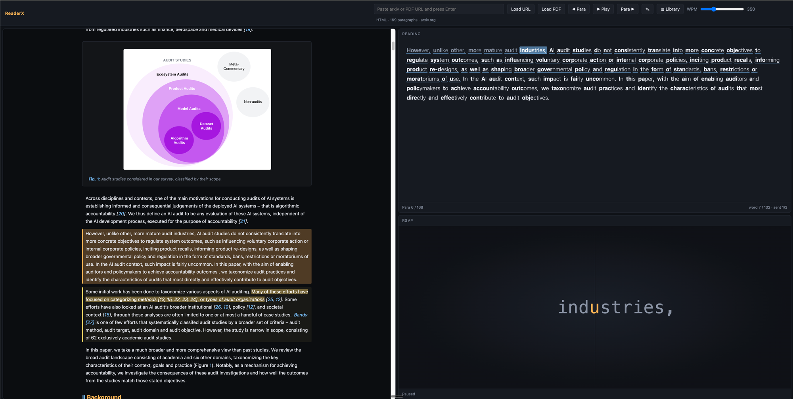

# ReaderX

> Nobody actually wants to read the paper. But your PI will ask about it on Monday. ReaderX is the compromise.



A three-pane PDF reader with a bionic-reading text pane and an RSVP speed-reader.

- **Left** — PDF rendered by [PDF.js](https://mozilla.github.io/pdf.js/). The paragraph you're on is highlighted.
- **Top right** — the current paragraph in full, with bionic-reading half-bold and per-word progress highlight.
- **Bottom right** — RSVP display: one word at a time, ORP-aligned to a vertical guideline.

Also supports arxiv URLs: paste `https://arxiv.org/abs/…` and it fetches the HTML rendering (falling back to `ar5iv.labs.arxiv.org`, then the PDF). HTML mode uses real `<p>` tags for paragraphing, so multi-column PDFs don't get mangled.

## Run

Just static files — serve the directory over HTTP:

```bash
python3 -m http.server 8765
```

Then open http://localhost:8765/.

## Keyboard

| Key | Action |
|---|---|
| Space | Play / pause RSVP |
| ← / → | Previous / next paragraph |
| ↑ / ↓ | Step one word back / forward |
| Shift + ← / → | Previous / next sentence |
| Home  or  `s` | Jump to start of current sentence and auto-play |
| `h` | Toggle highlight on current sentence |
| `l` | Open library |
| Esc | Close lightbox / library |

Click any paragraph on the PDF, or any word in the Reading pane, to jump to it.
Click any figure in HTML mode to open the lightbox.

## Storage

Papers you open, your reading position, and highlights are saved locally in your
browser (IndexedDB, database `readerx`). Nothing leaves your machine. Open the
**Library** to reopen recent papers or export all highlights as Markdown.

## Files

- `index.html`, `styles.css`, `app.js` — the app
- `rsvp-comprehension.pdf` — default sample: Rayner et al. 2016, *"So Much to Read, So Little Time"* (open access). RSVP is faster, but it hurts comprehension.
- `sample.pdf` — small fallback

## Notes on the algorithms

- **Paragraphs from PDFs** — inferred from line gaps + x-indentation (heuristic; two-column layouts are lossy).
- **Hyphenation** — end-of-line `word-\nfragment` is rejoined when the next line starts lowercase (also handles Unicode hyphen and soft hyphen).
- **Citations** — numeric brackets (`[12, 15]`), author-year parens (`(Smith 2020)`) and signal-phrase cites (`(see Gilchrist, 2011)`, `(e.g., Smith 2020)`, `(cf. Rayner et al., 2016)`) are stripped from the RSVP stream so timing stays clean.
- **RSVP timing** — base `60000 / wpm` ms per word, +15% for long words, +80% after sentence-ending punctuation, +35% after commas.
- **ORP table** — Spritz-style (`1 → 0`, `2–5 → 1`, `6–9 → 2`, `10–13 → 3`, `14+ → 4`).
- **Bionic bold** — hand-tuned lighter than [text-vide](https://github.com/Gumball12/text-vide)'s default; leading/trailing punctuation excluded from the bold span.

## License

MIT.
